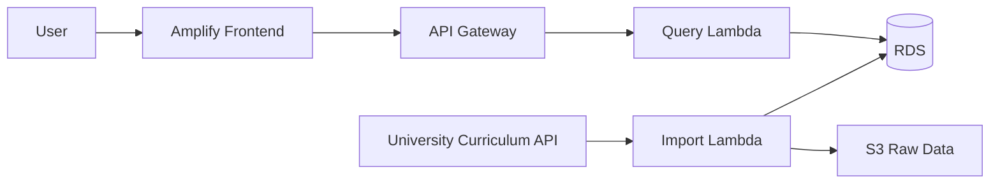

# ADR V2: Dynamic Data Architecture

## Status

Proposed

## Context

V1 ใช้ข้อมูลหลักสูตรที่เขียนอยู่ใน Frontend โดยตรง แต่ V2 ต้องรองรับข้อมูลหลายปีหลักสูตร การค้นหา การกรอง และการรับข้อมูลจาก University Curriculum API

## Decision

- ใช้ **AWS Amplify Hosting** สำหรับ Deploy Frontend จาก branch `main` หลังผ่านการ Review และ Merge แล้ว
- ใช้ branch `Frontend` สำหรับพัฒนาและส่ง Pull Request เท่านั้น
- ใช้ **API Gateway + Lambda** เป็น Backend API สำหรับ Frontend
- ใช้ **Amazon RDS** เก็บข้อมูลหลักสูตรที่ผ่านการจัดรูปแบบแล้ว
- ใช้ **University Curriculum API** เป็นแหล่งข้อมูลต้นทาง
- ให้ Lambda เป็นตัวเรียก API, ตรวจสอบข้อมูล และบันทึกลง RDS
- ใช้ **S3** เก็บไฟล์ดิบหรือไฟล์ Import ถ้าจำเป็น

## Data flow

## Alternatives considered

### CloudFront + S3 สำหรับ Frontend

แนวทาง CloudFront + S3 เหมาะสำหรับ V1 แต่เนื่องจากสภาพแวดล้อมที่ใช้มีข้อจำกัดด้านสิทธิ์ในการใช้งาน CloudFront ทีมจึงเลือก AWS Amplify Hosting เพื่อให้ Deploy Frontend ได้ง่ายขึ้น และรองรับการพัฒนาต่อใน V2 

### ให้ Frontend เรียก University API โดยตรง

ไม่เลือก เพราะทำให้ Frontend ผูกกับ API ภายนอกโดยตรง ควบคุมการแปลงข้อมูลและการจัดการข้อผิดพลาดได้ยากกว่า

### ใช้ S3 เป็นฐานข้อมูลหลัก

ไม่เลือก เพราะการค้นหาและกรองข้อมูลทำได้ไม่เหมาะเท่า Database จึงใช้ RDS เป็น Data Store หลัก และใช้ S3 สำหรับไฟล์ดิบหรือไฟล์ Import

## เหตุผลที่เลือกสถาปัตยกรรมนี้

V2 ต้องเก็บข้อมูลที่มีความสัมพันธ์กันหลายส่วน เช่น คณะ ภาควิชา หลักสูตร รายวิชา และวิชาบังคับก่อน รวมถึงต้องค้นหาและกรองข้อมูลตามปีการศึกษา คณะ สาขา และรหัสวิชา

ทีมจึงเลือกใช้ RDS เพราะเป็นฐานข้อมูลแบบ relational ที่เหมาะกับข้อมูลลักษณะนี้ และสามารถเชื่อมโยงข้อมูลหลายตารางได้ง่าย

ทีมไม่ได้เลือก DynamoDB เป็นฐานข้อมูลหลัก เพราะ DynamoDB ไม่มี JOIN แบบฐานข้อมูล relational และการค้นหาต้องออกแบบตาม partition key เป็นหลัก ซึ่งไม่เหมาะกับการค้นหาหลายเงื่อนไขของระบบ V2

ส่วน S3 ใช้เก็บไฟล์ JSON ดิบหรือไฟล์สำหรับ import เท่านั้น ไม่ได้ใช้เป็นฐานข้อมูลหลัก เพราะ S3 เหมาะกับการเก็บไฟล์มากกว่าการค้นหาข้อมูลที่มีความสัมพันธ์กัน

การใช้ API Gateway กับ Lambda ช่วยให้ Frontend เรียก API ได้โดยไม่ต้องเชื่อมต่อกับ RDS หรือ University API โดยตรง ทำให้ควบคุมการตรวจสอบข้อมูลและจัดการ error ได้จาก Backend

## Consequences

### Benefits

- Frontend Deploy และพัฒนาต่อได้ง่าย
- รองรับข้อมูลแบบ Dynamic และหลายปีหลักสูตร
- ลดการเรียก University API จาก Browser โดยตรง
- สามารถเก็บข้อมูลล่าสุดที่ Sync สำเร็จไว้ใน RDS

### Trade-offs

- ต้องพัฒนา Backend API เพิ่ม
- ต้องออกแบบขั้นตอน Sync ข้อมูลกับ University API
- ต้องดูแลค่าใช้จ่ายและสิทธิ์ของ RDS, Lambda และ API Gateway

## Scope

ADR นี้ครอบคลุม V2 เท่านั้น ยังไม่รวม Authentication, Role-based Access Control และการตรวจสอบการสำเร็จการศึกษารายบุคคล
