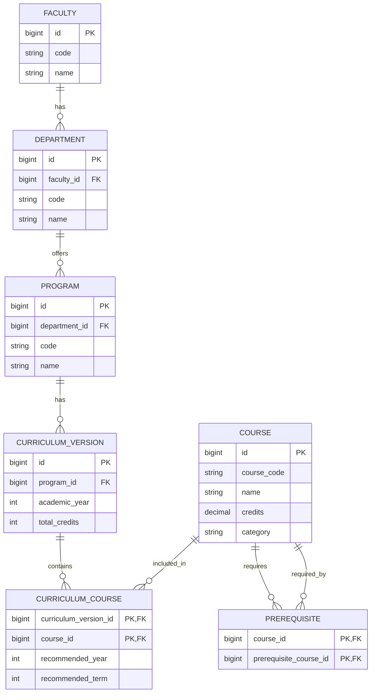

# [Architecture] Data Model / ERD สำหรับ V2

## Goal

ออกแบบ Data Model สำหรับข้อมูลหลักสูตร รายวิชา และวิชาบังคับก่อน เพื่อรองรับข้อมูลหลายปีหลักสูตร การค้นหา และการกรองข้อมูลใน V2

## Entities

## Design notes

- `CURRICULUM_VERSION` แยกปีหลักสูตร เพื่อให้โปรแกรมเดียวมีหลายหลักสูตรตามปีการศึกษาได้
- `CURRICULUM_COURSE` เป็นตารางเชื่อมระหว่างหลักสูตรกับรายวิชา
- `PREREQUISITE` รองรับความสัมพันธ์วิชาบังคับก่อนแบบหลายต่อหลาย
- ข้อมูลจาก University Curriculum API ควรถูกแปลงเข้าสู่ Model นี้ก่อนส่งให้ Frontend

## Acceptance criteria

- มี ERD ที่ทีมเห็นชอบ
- รองรับหลักสูตรหลายปีการศึกษา
- รองรับการค้นหารายวิชาและกรองตามหลักสูตร/หมวดวิชา
- รองรับการแสดงวิชาบังคับก่อน
- ระบุ Mapping ระหว่างข้อมูลจาก API กับ Entity ในระบบ
