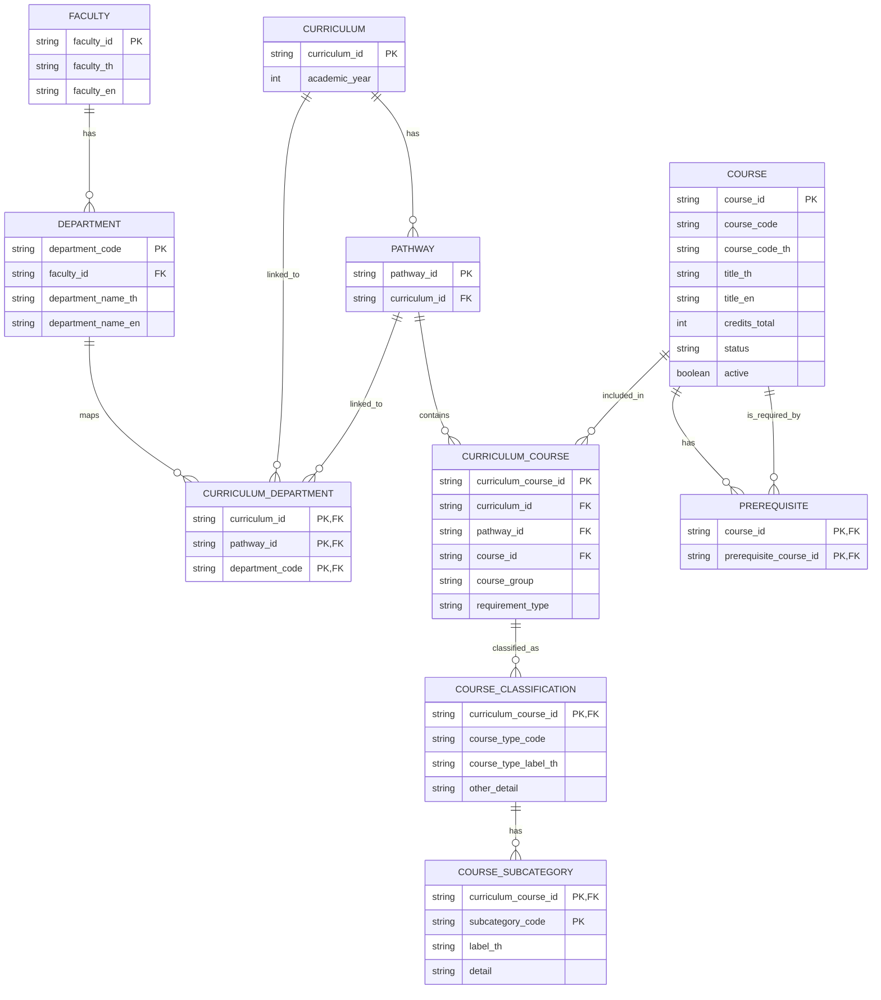

# [Architecture] Data Model / ERD สำหรับ V2

## Goal

ออกแบบ Data Model สำหรับข้อมูลหลักสูตร รายวิชา และวิชาบังคับก่อน เพื่อรองรับข้อมูลหลายปีหลักสูตร การค้นหา และการกรองข้อมูลใน V2

## Entities

## Design notes

- `FACULTY` และ `DEPARTMENT` รับข้อมูลจาก Faculty API และ Department API
- `CURRICULUM`, `PATHWAY`, `COURSE` และ `CURRICULUM_COURSE` รับข้อมูลจาก Course Catalog API
- `COURSE` แยกจาก `CURRICULUM_COURSE` เพราะวิชาเดียวกันสามารถอยู่ได้หลาย pathway
- `CURRICULUM_DEPARTMENT` ใช้เชื่อมข้อมูลสาขาจาก University API กับหลักสูตรจาก Course Catalog API
- ID จาก API ใช้ชนิดข้อมูล `string` เพราะเป็นรหัส เช่น `BSC-CS-2566-CIS-CS100`
- `CURRICULUM_COURSE` เป็นตารางเชื่อมระหว่าง pathway กับรายวิชา
- `COURSE_CLASSIFICATION` เก็บประเภทและหมวดหมู่ของรายวิชาตาม curriculum placement
- `PREREQUISITE` รองรับความสัมพันธ์วิชาบังคับก่อนแบบหลายต่อหลาย
- ข้อมูลจากทั้งสาม API ควรถูกแปลงเข้าสู่ Model นี้ก่อนส่งให้ Frontend

## Acceptance criteria

- มี ERD ที่ทีมเห็นชอบ
- รองรับหลักสูตรหลายปีการศึกษา
- รองรับการค้นหารายวิชาและกรองตามหลักสูตร/หมวดวิชา
- รองรับการแสดงวิชาบังคับก่อน
- ระบุ Mapping ระหว่างข้อมูลจาก API กับ Entity ในระบบ
